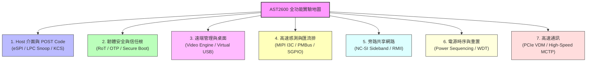

# ASPEED AST2600 晶片功能全景分析與未來實戰實驗 (Labs) 規劃指南

> **文件版本**：v1.0 | **整理日期**：2026-08-21
> **適用角色**：跨平台 (BIOS/BMC) 韌體架構師、OpenBMC 資深開發工程師
> **儲存路徑**：`meta-onyx/docs/ast2600-future-labs-and-development-roadmap.md`

---

## 1. 為什麼需要本規劃指南？

在完成前 9 個基礎實戰練習（DC-SCM DTS、MCTP/PLDM、Redfish/Sensor）後，為了進一步發揮 **AST2600** 晶片的全部硬體潛能，並深化跨平台 (BIOS/BMC) 的協同設計能力，本指南依據 AST2600 硬體規格，規劃了 **7 大進階主題、共 15 個可實作實驗與開發專案**。

每個主題均標註了：
- **硬體 IP 與原理**
- **BIOS ↔ BMC 協同架構**
- **QEMU 模擬可行性**
- **實作建議與驗證方式**

---

## 2. AST2600 進階實驗地圖



---

## 3. 七大進階實驗主題詳解

### 主題 1：Host 開機除錯與 POST Code 監控 (eSPI / LPC Snoop)

#### 🔹 概念與架構
* **硬體單元**：AST2600 LPC/eSPI Snoop Controller (`0x1E78_8000`)
* **BIOS 協同**：UEFI PEI/DXE 階段向 I/O Port `0x80` / `0x81` 寫入 POST Code（如 `0x15` 代表記憶體初始化、`0x78` 代表 ACPI 初始化）。
* **BMC 角色**：硬體 Snoop FIFO 即時捕獲每筆 1-byte/2-byte POST Code，由驅動推送到 D-Bus `xyz.openbmc_project.State.Boot.PostCode`，並記錄至 Redfish `LogServices/PostCodes`。

#### 🧪 可規劃實驗：
1. **Lab 4-1: 模擬 Host 寫入 Port 80h POST Code**
   * 使用 Linux `aspeed_lpc_snoop` 驅動或 sysfs 模擬器發送連續開機碼。
   * 驗證 OpenBMC `postcode-manager` 服務接收並寫入持久化日誌。
   * 透過 Redfish 查詢 `/redfish/v1/Systems/system/LogServices/PostCodes/Entries` 輸出。
2. **Lab 4-2: POST Code 開機超時與死當告警 (POST Code Hang Watchdog)**
   * 當停留在特定 POST Code（如 `0x55` 記憶體錯誤）超過 60 秒時，BMC 自動觸發 SEL 紀錄並產生 SNMP Trap 告警。

---

### 主題 2：硬體信任根 (Root of Trust) 與安全開機 (Secure Boot)

#### 🔹 概念與架構
* **硬體單元**：AST2600 Secure Boot Engine, OTP Memory (`0x1E6E_2000`), HACE Crypto Engine (`0x1E6C_0000`)
* **安全鏈條 (Chain of Trust)**：
  1. AST2600 硬體 ROM Code 讀取內部 OTP 燒錄的 RSA-4096 / ECC 公鑰雜湊值。
  2. 驗證 U-Boot SPL 數位簽章。
  3. U-Boot SPL 驗證 U-Boot Proper。
  4. U-Boot Proper 驗證 Linux FIT Image (Kernel + DTB + Initramfs)。
  5. Linux 驗證 Host BIOS 韌體簽章 (PFR / Cerberus 架構)。

#### 🧪 可規劃實驗：
1. **Lab 5-1: 使用 ASPEED `socsec` 與 `otptool` 建立簽章開機鏈**
   * 生成 RSA-2048 / RSA-4096 密鑰對。
   * 使用 `otptool` 生成虛擬 OTP 配置檔 (`otp-all.image`)。
   * 使用 `socsec` 對 U-Boot SPL 進行簽章。
   * 在 QEMU 中啟用 Secure Boot 模擬驗證（驗證失敗時阻止開機）。

---

### 主題 3：遠端 KVM 桌面與虛擬光碟機 (Video Engine & USB Virtual Hub)

#### 🔹 概念與架構
* **硬體單元**：AST2600 Video Engine (`0x1E70_0000`), USB 2.0 Virtual Hub (`aspeed-vhub`)
* **原理**：
  * **Video Engine**：即時捕捉 Host GPU 輸出的 1080p 畫面，硬體壓縮為動態 JPEG 區塊串流。
  * **USB Virtual Hub**：模擬 USB HID（鍵盤/滑鼠）與 USB Mass Storage（隨身碟/光碟機）。
  * **bmcweb**：透過 WebSocket 提供 HTML5 Web KVM 介面與 Virtual Media ISO 映像檔掛載。

#### 🧪 可規劃實驗：
1. **Lab 6-1: 模擬 Host VGA 畫面變更與 Video Engine 差異壓縮**
   * 在 QEMU 內測試 `aspeed-video` 驅動。
   * 透過 WebSocket 接收 `/kvm/0` 影像串流。
2. **Lab 6-2: Virtual Media 遠端掛載 ISO 開機**
   * 透過 Redfish `/redfish/v1/Managers/bmc/VirtualMedia/CD1/Actions/VirtualMedia.InsertMedia` 掛載遠端 HTTP ISO。
   * 驗證 Linux `jsnbd` (Network Block Device) 與 USB Mass Storage 模擬。

---

### 主題 4：次世代 MIPI I3C 匯流排與高效能感測器

#### 🔹 概念與架構
* **硬體單元**：AST2600 MIPI I3C 控制器 (4 組, 12.5 MHz)
* **為何取代 I2C？**
  * 速度由 1 MHz 提升至 **12.5 MHz ~ 33.3 MHz**（提高 12~30 倍）。
  * **動態位址分配 (DAA)**：無需在 DTS 中寫死固定 I2C Slave Address。
  * **帶內中斷 (IBI)**：感測器異常時可在同一組資料線上直接發送中斷，節省大量 GPIO 腳位。

#### 🧪 可規劃實驗：
1. **Lab 7-1: MIPI I3C 設備探測與動態位址分配 (DAA) 流程**
   * 撰寫 I3C 虛擬設備模型，測試 Linux `drivers/i3c/master/ast2600-i3c.c` 驅動。
   * 驗證 IBI (In-Band Interrupt) 告警觸發。

---

### 主題 5：NC-SI 旁路共享網路管理 (Shared NIC Out-of-Band)

#### 🔹 概念與架構
* **硬體單元**：AST2600 Gigabit MAC (MAC1~4) + NC-SI 1.1 硬體介面
* **原理**：
  * 伺服器無需獨立的專用 BMC 網路孔（Dedicated Port），而是透過 NC-SI 協定與主機網卡（如 Mellanox ConnectX 或 Intel X550）共用實體網孔。
  * BMC 透過 NC-SI 指令查詢主機網卡狀態、鏈路速度、VLAN 配置。

#### 🧪 可規劃實驗：
1. **Lab 8-1: 使用 `ncsi-netlink` 工具進行 NC-SI 封包互動**
   * 測試 `ncsi-cmd` 查詢 Package / Channel 狀態。
   * 配置 NC-SI VLAN 標籤過濾。

---

### 主題 6：主機電源時序 (Power Sequencing) 與看門狗硬體復原

#### 🔹 概念與架構
* **硬體單元**：AST2600 GPIO Pass-through, Watchdog Timers (WDT1~4)
* **架構師核心工作**：
  * **Intel / AMD 開機時序 (Chassis Power State Machine)**：
    * `S5 (Soft Off)` → 待機電壓正常 (`PS_ON`) → `S3 (Suspend)` → `S0 (Working)` → `POWER_OK`。
  * **Dual Flash 切換 (Flash Recovery)**：
    * 若 WDT3 偵測到 Host BIOS 開機掛死（POST Hang），自動切換 GPIO MUX 啟動備份 SPI Flash（Secondary BIOS Flash）。

#### 🧪 可規劃實驗：
1. **Lab 9-1: Intel/AMD 主機電源狀態機 (x86-power-control) 實戰**
   * 模擬 `POWER_BUTTON_N`、`RESET_BUTTON_N`、`SYS_PWROK`、`SIO_S3_N`、`SIO_S5_N` 腳位訊號。
   * 驗證 `xyz.openbmc_project.State.Host` 與 `State.Chassis` 狀態轉換。
2. **Lab 9-2: Dual SPI Flash 自動容錯切換 (Failover Recovery)**
   * 模擬主 Flash 損壞，WDT 超時觸發 GPIO 切換至備用 SPI Flash。

---

### 主題 7：PCIe VDM 高速 MCTP / PLDM 端點

#### 🔹 概念與架構
* **硬體單元**：AST2600 PCIe Gen2 Controller (Endpoint Mode)
* **優勢**：
  * 相比傳統 I2C (100KB/s) 或 KCS (1MB/s)，PCIe VDM 可提供高達 **500MB/s** 的頻寬。
  * 適合大量遙測數據（Telemetry Streaming）與 64MB 以上的 BIOS / CPLD 韌體秒級更新。

#### 🧪 可規劃實驗：
1. **Lab 10-1: MCTP over PCIe VDM 高速韌體傳輸測試**
   * 比較 I2C MCTP vs. PCIe MCTP 傳輸 32MB BIOS Image 的耗時與狀態機行為。

---

## 4. 推薦學習與開發路線圖

```text
┌────────────────────────────────────────────────────────────────────────┐
│  Phase 1: 已完成基礎實戰 (9 Labs)                                      │
│  • Lab 1: DC-SCM DTS (EEPROM, GPIO LED, TMP75)                         │
│  • Lab 2: MCTP/PLDM (pldmtool, BIOS Sim, FW Update Sim)                │
│  • Lab 3: Redfish & Sensor (Virtual Sensor, Voltage, Fan Control OEM)  │
└───────────────────────────────────┬────────────────────────────────────┘
                                    │
                                    ▼
┌────────────────────────────────────────────────────────────────────────┐
│  Phase 2: Host 協同與開機深度整合 (BIOS 架構師核心)                    │
│  • Lab 4: eSPI / LPC Snoop (Port 80h POST Code 監控與 Hang 告警)       │
│  • Lab 9: x86 Power Sequencing (S5->S0 電源時序與 Dual-Flash 容錯切換) │
└───────────────────────────────────┬────────────────────────────────────┘
                                    │
                                    ▼
┌────────────────────────────────────────────────────────────────────────┐
│  Phase 3: 雲端大廠企業級特性 (Enterprise & CSP Features)               │
│  • Lab 5: Hardware Root of Trust (OTP Key 燒錄與 Secure Boot 開機鏈)   │
│  • Lab 6: Remote KVM & Virtual Media (HTML5 桌面與 ISO 遠端安裝)       │
│  • Lab 8: NC-SI 共享網卡 (Sideband Out-of-Band 管理)                   │
└────────────────────────────────────────────────────────────────────────┘
```

---

*本文件由 ONYX 韌體架構組編撰，作為 AST2600 晶片潛能開發與未來進階實驗的設計藍圖。*
